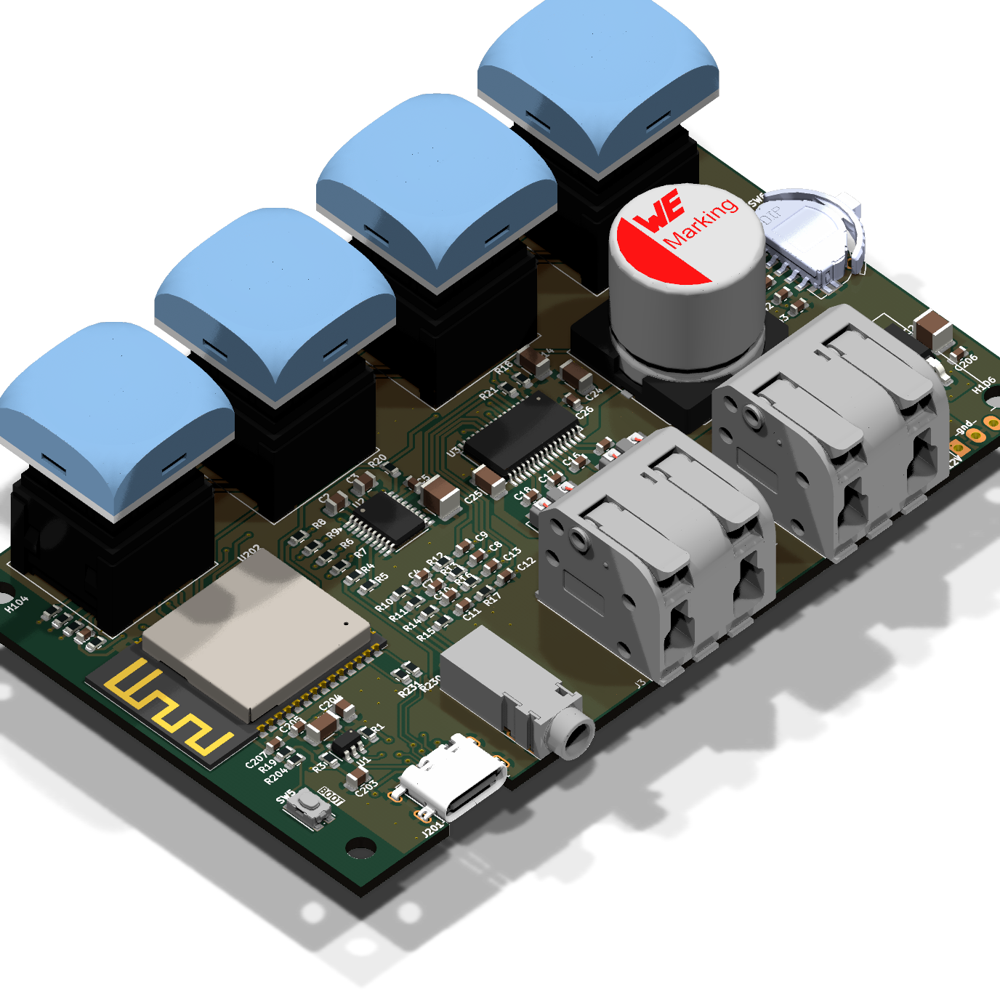

# KINK-box

A web-based radio player for KINK streams, powered by an ESP32-S3 microcontroller with integrated audio amplification.

## Overview

KINK-box is a dedicated streaming device combining an ESP32-S3 processor with audio amplification circuitry. Control it through a simple web interface to listen to KINK radio channels.

## Features

- **ESP32-S3 Based**: Dual-core processor with integrated WiFi
- **Web Interface**: Control playback and stream selection from your browser
- **Built-in Amplifier**: Direct speaker connection
- **KINK Radio Optimized**: Seamless streaming of KINK stations

## Quick Start

1. **Assembly**: Reference the component placement guide and [Bill of Materials](kicad-artifacts/KINK-box_bom.csv)
2. **Power On**: Connect to WiFi
3. **Access**: Open `http://<device-ip>` in your browser
4. **Enjoy**: Select KINK channels and adjust volume

## Hardware Files

All manufacturing and design files are in `kicad-artifacts/`:
- **Gerbers**: `KINK-box_gerbers.zip` - For PCB fabrication
- **Schematics**: `KINK-box_schematic.pdf`
- **3D Model**: `KINK-box_board.step`
- **Interactive BOM**: `ibom.html`

## License

Apache License 2.0 - see [LICENSE](LICENSE) for details.

---

**KINK-box** - Simple web radio for KINK streams.
